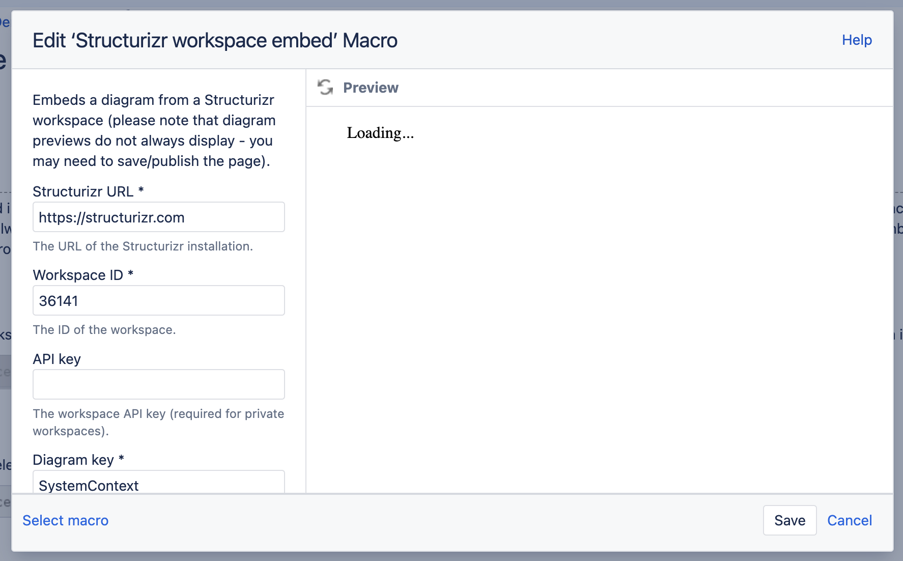

# Structurizr macros for Confluence on Atlassian Cloud

This repository contains the source code for a macro that embeds diagrams from a Structurizr workspace into Confluence on Atlassian Cloud,
and is available via the [Atlassian Marketplace](https://marketplace.atlassian.com/vendors/1213399).

When editing a page, type `{structurizr` or `/structurizr` (depending on the Confluence version) to insert the macro into your page.
You will need the following information:

- Workspace ID
- Workspace API key (from the workspace settings page)
- Diagram key (this is shown after the <code>#</code> symbol when viewing a diagram)

Please note that diagram previews do not always display - you may need to save/publish the page.

This macro embeds diagrams via an iframe; see [Structurizr - Help - iframe embed](https://structurizr.com/help/embed-iframe) on the Structurizr website for more details.